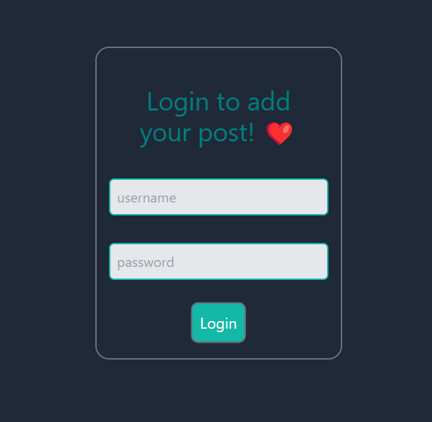
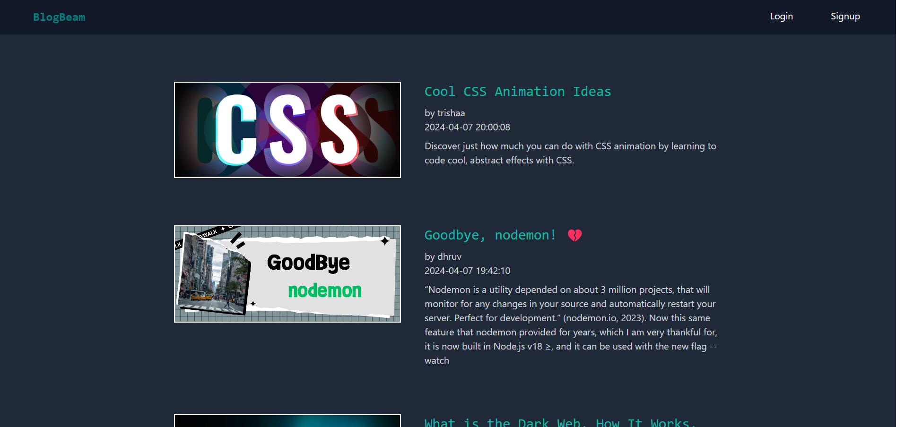
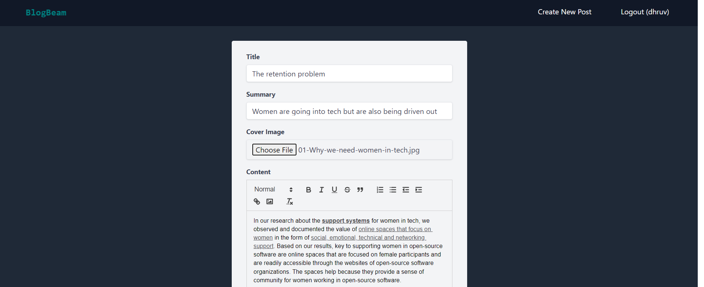
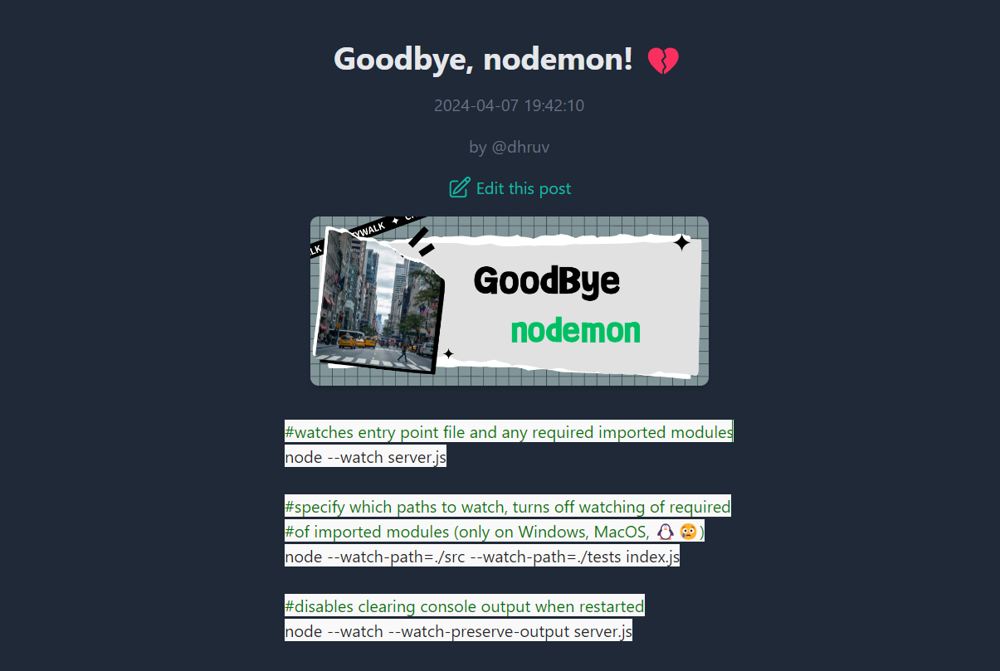
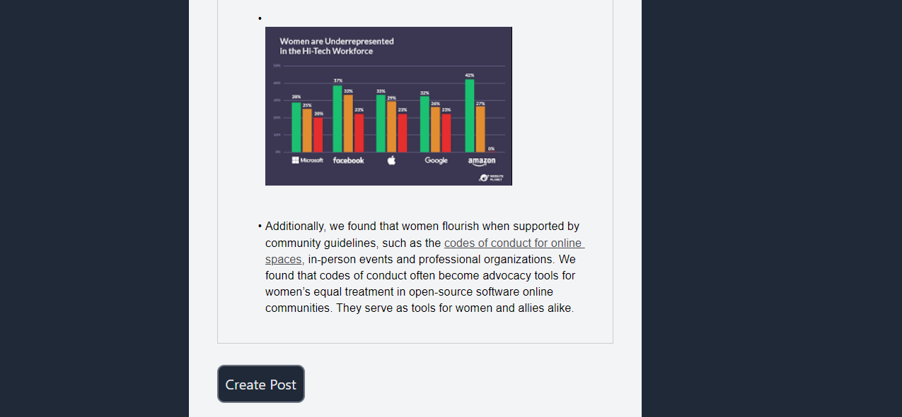
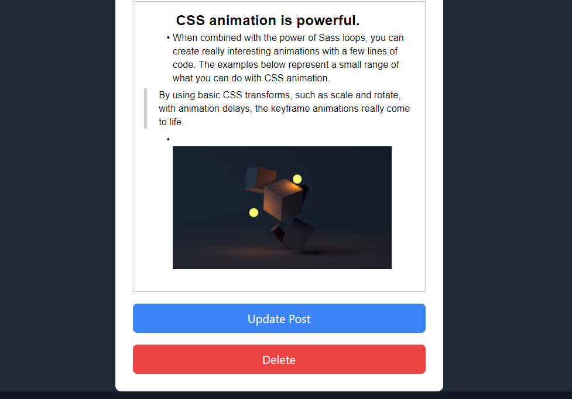

# BlogBloom

Welcome to the BlogPost Application! This powerful and intuitive platform lets users create, edit, and manage their blogs seamlessly. Whether you're a seasoned blogger or just starting, our application provides all the tools you need to share your stories with the world.

## Features

- **User Authentication:** Secure and reliable authentication to keep your blogs safe and personalized.
- **Home Page:** A dynamic home page that showcases the latest and most popular blogs.
- **Create Blog:** An intuitive editor for creating beautiful blog posts with ease.
- **Edit Blog:** Easily update and refine your existing blogs.
- **User Dashboard:** Manage all your blogs, track performance, and engage with your audience.

## Screenshots

To give you a better feel for the application, here are some screenshots of the key features:

1. **Authentication**  
   
   
2. **Home Page**  
   

3. **Create Blog**  
   

4. **Edit Blog**  
   

5. **Images Inside Blog**  
   

6. **Blog Preview**  
   

